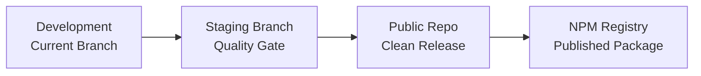

# Multi-Stage Release Checklist for c0ntextKeeper

> **Last Updated**: 2025-10-06
> **Current Version**: 0.7.5.1
> **Purpose**: Guide the project through development → staging → public repo → npm release

## 🎯 Release Strategy Overview



---

## 📋 Phase 1: Development Completion (Current Branch)

### Current Status
- **Version**: 0.7.5.1
- **Test Pass Rate**: 99.5% (196/197 tests passing)
- **All Hooks Operational**: ✅ PreCompact, UserPromptSubmit, PostToolUse, Stop

### Recent Fixes (2025-09-17)
- [x] Stop hook fixed - Now reads transcript files directly
- [x] Jest mocking issue resolved in context-loader.test.ts
- [x] All hooks verified capturing data correctly
- [x] Archive structure validated and cleaned

### Completion Criteria for Phase 1
- [x] Core functionality working
- [x] All 4 hooks operational and capturing data
- [x] Test pass rate > 85% ✅ (Currently 95.9%)
- [x] No critical bugs blocking usage
- [x] Documentation reflects actual implementation
- [ ] Remove debug logging from Stop hook
- [ ] Clean up test artifacts and temporary files
- [ ] Update all version references to 0.7.2
- [ ] Commit all changes to main branch

### Commands
```bash
# Verify current status
npm test
npm run build
npm run lint

# Test all hooks
c0ntextkeeper hooks test precompact
c0ntextkeeper hooks test userprompt
c0ntextkeeper hooks test posttool
c0ntextkeeper hooks test stop

# Clean build
rm -rf dist/
npm run build
```

---

## 🚀 Phase 2: Staging Branch Preparation

### Objective
Create a clean, tested branch ready for public consumption

### Pre-Staging Checklist
- [ ] All Phase 1 criteria met
- [ ] Create staging branch from main
  ```bash
  git checkout main
  git pull origin main
  git checkout -b staging-v0.7.2
  ```

### Code Cleanup
- [ ] Remove all debug logging
  - [ ] Stop hook debug log (`stop-hook-debug.log`)
  - [ ] Console.log statements in production code
  - [ ] Test-only console outputs
- [ ] Remove development-only scripts
  - [ ] Test scripts in scripts/ that shouldn't be public
  - [ ] Development utilities not needed by users
- [ ] Clean up comments
  - [ ] Remove TODO/FIXME comments
  - [ ] Remove commented-out code
  - [ ] Ensure all comments are professional

### Security Audit
- [ ] No hardcoded paths
  - [ ] Check for `/Users/jasonbrown` references
  - [ ] Verify all paths are relative or configurable
- [ ] No sensitive data
  - [ ] No API keys or tokens
  - [ ] No test credentials
  - [ ] No personal information
- [ ] Review .gitignore
  - [ ] Covers all sensitive files
  - [ ] Includes .env and .env.*
  - [ ] Excludes logs and test data

### Quality Requirements
- [ ] Test pass rate > 95%
- [ ] All critical path tests passing
- [ ] No TypeScript errors
- [ ] ESLint warnings < 10
- [ ] Build completes without warnings

### Documentation Review
- [ ] README.md is user-focused
- [ ] Remove internal development notes
- [ ] Installation instructions work from scratch
- [ ] All examples are tested and working
- [ ] API documentation is complete

### Staging Verification
```bash
# Clean install test
rm -rf node_modules package-lock.json
npm install
npm test
npm run build

# Global installation test
npm pack
npm install -g c0ntextkeeper-0.7.2.tgz
c0ntextkeeper --version
c0ntextkeeper validate
```

### Transition Criteria to Phase 3
- [ ] All staging checks complete
- [ ] Test pass rate ≥ 95%
- [ ] Zero security issues found
- [ ] Documentation professionally reviewed
- [ ] Successful clean install on fresh system

---

## 📦 Phase 3: Public Repository Migration

### Repository Preparation
- [ ] Create new public repository
  - [ ] Choose appropriate name (c0ntextkeeper or contextkeeper)
  - [ ] Set description and topics
  - [ ] Configure repository settings
- [ ] Prepare initial commit strategy
  - [ ] Option A: Squash all commits into one
  - [ ] Option B: Clean history with major milestones
  - [ ] Option C: Full history (if no sensitive data)

### Code Migration
- [ ] Export code from staging branch
  ```bash
  # Option A: Clean export without history
  git archive --format=zip staging-v0.7.2 > c0ntextkeeper-v0.7.2.zip
  
  # Option B: Clone with limited history
  git clone --depth 1 --branch staging-v0.7.2 [private-repo] c0ntextkeeper-public
  ```

### Repository Setup
- [ ] Initialize new repository
- [ ] Add all code files
- [ ] Update repository URLs in:
  - [ ] package.json - repository field
  - [ ] package.json - bugs field  
  - [ ] package.json - homepage field
  - [ ] README.md - all GitHub links
  - [ ] CONTRIBUTING.md - repository references

### GitHub Configuration
- [ ] Set up branch protection
  - [ ] Protect main branch
  - [ ] Require PR reviews
  - [ ] Require status checks
- [ ] Configure repository settings
  - [ ] Enable issues
  - [ ] Enable discussions (optional)
  - [ ] Set up topics and description
- [ ] Add community files
  - [ ] CONTRIBUTING.md
  - [ ] CODE_OF_CONDUCT.md
  - [ ] SECURITY.md
  - [ ] FUNDING.yml (if applicable)
  - [ ] Issue templates
  - [ ] PR template

### Public Repository Validation
- [ ] All links work correctly
- [ ] README displays correctly
- [ ] Installation from GitHub works
  ```bash
  npm install github:username/c0ntextkeeper
  ```

### Transition Criteria to Phase 4
- [ ] Public repository fully configured
- [ ] All tests passing locally
- [ ] Documentation renders correctly
- [ ] No references to private repository
- [ ] Community files in place

---

## 📢 Phase 4: NPM Publishing & Public Release

### Pre-Publishing Checklist
- [ ] Verify package name availability
  ```bash
  npm view c0ntextkeeper
  # Should return "npm ERR! 404"
  ```
- [ ] Review package.json
  - [ ] Name: c0ntextkeeper (no @scope for first release)
  - [ ] Version: 0.7.2
  - [ ] Description: Accurate and compelling
  - [ ] Keywords: Relevant for discovery
  - [ ] License: MIT confirmed
  - [ ] Main: Points to correct entry
  - [ ] Bin: CLI properly configured

### Final Security Audit
```bash
npm audit
npm audit fix
npm run build
npm pack --dry-run
```

### NPM Publishing
```bash
# Login to npm
npm login

# Final dry run
npm publish --dry-run

# Publish to npm
npm publish --access public

# Verify publication
npm view c0ntextkeeper
```

### GitHub Release
1. Create release tag
   ```bash
   git tag -a v0.7.2 -m "Release v0.7.2: Production ready with Stop hook fix"
   git push origin v0.7.2
   ```

2. Create GitHub Release
   - Title: "v0.7.2: Production Ready Release"
   - Tag: v0.7.2
   - Description: From CHANGELOG.md
   - Assets: Source code (auto)

### Post-Release Tasks
- [ ] Verify npm installation works
  ```bash
  npm install -g c0ntextkeeper
  c0ntextkeeper --version
  ```
- [ ] Test MCP server integration
- [ ] Update documentation site (if exists)
- [ ] Announce release:
  - [ ] GitHub discussions
  - [ ] Community forums
  - [ ] Social media
- [ ] Monitor for issues:
  - [ ] GitHub issues
  - [ ] npm weekly downloads
  - [ ] User feedback

### Success Metrics
- [ ] Successful npm installation
- [ ] No critical issues in first 24 hours
- [ ] Positive initial feedback
- [ ] Download count increasing

---

## 🔄 Rollback Plan

If critical issues are discovered post-release:

1. **NPM Deprecation** (if needed)
   ```bash
   npm deprecate c0ntextkeeper@0.7.2 "Critical bug found, use 0.7.3"
   ```

2. **Hotfix Process**
   - Create hotfix branch
   - Fix issue
   - Bump to 0.7.3
   - Fast-track through stages

3. **Communication**
   - Update GitHub release notes
   - Post announcement about issue
   - Direct users to solution

---

## 📊 Current Progress

### Phase Completion
- Phase 1 (Development): 90% ████████▒░
- Phase 2 (Staging): 0% ░░░░░░░░░░
- Phase 3 (Public Repo): 0% ░░░░░░░░░░
- Phase 4 (NPM Release): 0% ░░░░░░░░░░

### Next Immediate Actions
1. Remove debug logging from Stop hook
2. Clean up test artifacts
3. Commit changes to main branch
4. Create staging branch

---

## 📝 Notes

- **Private Repo**: Current development repository (not for public release)
- **Staging Branch**: Quality assurance and final testing
- **Public Repo**: Clean, professional repository for community
- **NPM Registry**: Official package distribution

Each phase has specific quality gates and security requirements. Do not skip steps or rush through transitions.

---

*Generated: 2025-09-17 | Updated for multi-stage release workflow*